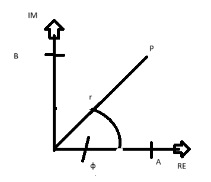
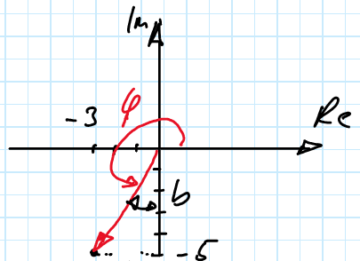

# img

umrechnung Komponentenform -> Polarform

$$
r = |z| = \sqrt{a^2+b^2}\\
\tan(\phi) = \frac{a}{b} \\
=> \phi = \arctan(\frac{b}{a})
$$
bsp
$$
z_1 = 3 +5i\\ \tan(\phi_1) = \frac{a}{b} = \frac{5}{3} \\ \phi = 59°\\
z_2 = -3-5i\\

$$

$$
\tan(\phi_2) = \frac{a}{b} = \frac{-5}{-3} = \frac{5}{3}\\
\phi_2 = 59°\\
\phi = 180° +\phi_2 = 180°+59° = 239°
$$