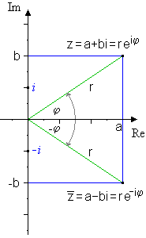

# Erste Schularbeit

## **Stoff**

### **Komplexe Zahlen**

- [ ] Umrechnen in andere Darstellungsform
- [x] Grundrechenarten

### **Vektoren**
  
- [x] Länge von Vektoren
- [x] Winkel zwischen Vektoren
- [x] Normalvektor berechnen
- [x] Skalarprodukt
- [x] Vektoren im Raum
- [x] Kreuzprodukt
- [x] Flächen- und Volums- Berechnung
- [ ] Parameterdarstellung von Geraden

## **Formeln und Theorie**

## **Vektoren**
- **Darstellung**

    $$
    \vec{a}_1= \left(\begin{array}{c} a_x \\ a_y \\ a_z \end{array}\right)
    $$

---
- **Betrag**
  
    $$
    \boxed{\vec{|a|} = \sqrt{a_x^2 \times a_x^2}}
    $$

---
- **Multiplizieren mit Scalar**

    $$
    \boxed{r\times \vec a = \left(\begin{array}{c} r \times a_x \\ r \times a_y \\ r \times a_z \end{array}\right)}
    $$
---
- **Einheits Vector**

    $$
    \boxed{\vec a_0 = \frac{1}{|\vec a|} \times \vec a}\\
    \downarrow\\
    \boxed{|\vec a_0| = 1}
    $$
---
- **Skalar Produkt**

    $$
    \boxed{\vec a \times \vec b = |\vec a|\times |\vec b| \times  \cos (\phi) = a_x \times b_x + a_y \times b_y + a_z \times b_z}\\\downarrow\\ \boxed{\frac{\vec a \times \vec b}{|\vec a|\times |\vec b|} = cos(\phi)}\\
    \text{stehen 2 Vectoren normal aufeinander: } \vec a \times \vec b = 0
    $$
---
- **Kreuzprodukt**

    $$
    \boxed{
    \vec a \bigotimes \vec b = \left(\begin{array}{c} a_x \\ a_y \\ a_z \end{array}\right) \bigotimes \left(\begin{array}{c} b_x \\ b_y \\ b_z \end{array}\right) = \left(\begin{array}{c} a_y \times b_z + b_y \times a_z \\  a_z \times b_x + b_z \times a_x \\  a_x \times b_y + b_x \times a_y \end{array}\right)
    }
    $$
    $$
    \boxed{
    A_{Parallelogramm} = |\vec a \bigotimes \vec b|
    }
    $$
    $$
    \boxed{
    A_{Dreieck} = \frac{1}{2}|\vec a \bigotimes \vec b|
    }
    $$
    $$
    \boxed{
    V_{paralelleolologmonadvjs} = |(\vec a \bigotimes \vec b)\times \vec c|
    }
    $$
    $$
    \boxed{
    V_{pyramide} = \frac{1}{2}|(\vec a \bigotimes \vec b)\times \vec c|
    }
    $$
---

- **Parameter Darstellung von Geraden**

    $$
    \boxed{X = P + t \times \vec g}\\
    X...\text{Punkt im } \R^3\\
    P...\text{bekannter Punkt im } \R ^3\\
    t...\text{Parameter element } \R\\
    \vec g...\text{Richtungsvektor}
    $$

---
## **Komplexe Zahlen**

- **Darstellung**
  
    $$
    \boxed{z = a + i \times b}\\
    z...\text{Komplexe Zahl}\\
    a...\text{Real Teil}\\
    b...\text{imaginär Teil}\\
    i = \sqrt{-1}
    $$
---

- **Umrechnen**

    $$
    \boxed{\phi = \tan^{-1}(\frac{Im}{Re})}\\
    \text{danach in den richtigen qadranten verschieben}\\
    \text{I qadrant }\phi = \phi\\
    \text{II qadrant }\phi = 180° - \phi\\
    \text{III qadrant }\phi = 180° + \phi\\
    \text{VI qadrant }\phi = 360° - \phi\\
    $$
    $$
    \boxed{r = \sqrt{Ra^2 +Im^2}}
    $$

---
- **Addition**

    $$
    \boxed{z_1+z_2 = (a+c) + i\times(b+d)}\\
    \text{real und imaginär Teil von $z_1$ und $z_2$ jeweils addieren}
    $$
---
- **Subtraktion**
    $$
    \boxed{z_1+z_2 = (a-c) + i\times(b-d)}\\
    \text{real und imaginär Teil von $z_1$ und $z_2$ jeweils subtrahieren}
    $$
    ---
- **Multiplikation**

  - komponenten Form:
  
    $$
    \boxed{ac - b d +i\times (b c + ad)}\\
    $$
  - Polar Form:
  
    $$
    z = r \times e^{i\phi}\\
    \downarrow \text{with}\\
    \boxed{z_1 \times z_2 = r_1 \times r_2 \times e^{i(\phi_1+\phi_2)}}
    $$
    ---
- **konjugiert komplexe Zahl z\***

    $$
    \boxed{z^* = c- i\times b}\\
    \text{Die zeiger r sind gleich lang, der Winke }\phi^* = -\phi
    $$
    
    ---
- **Dividieren**

  - komponenten Form:
    $$
    \frac{z_1}{z_2}=\frac{a+ib}{c+id}\\
    \text{ Nenner soll real werden }\downarrow\\
    \boxed{\frac{z_1}{z_2} = \frac{ac+bd+i(bc-ad)}{c^2+d^2}}
    $$
  - polar Form:
    $$
    \boxed{\frac{z_1}{z_2}=\frac{r_1}{r_2}\times e ^{i(\phi_1 - \phi_2)}}
    $$
---
## **Beispiele**

### **Vektoren**

### **Komplexe Zahlen**

