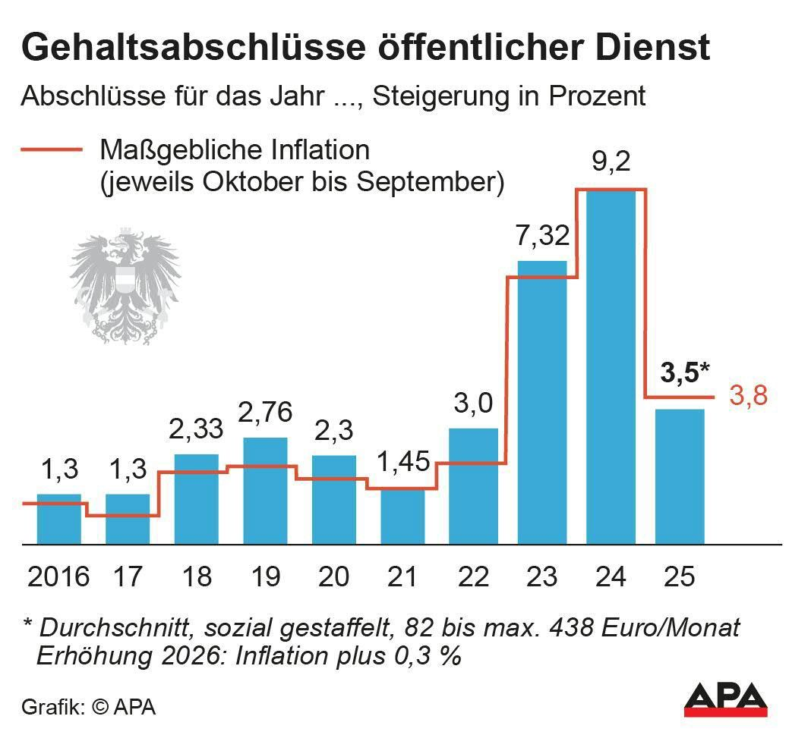

# **Wochen Überblick**

by Jan Weichhart

---

## **Russland Ukraine**

- Russland hat in der Nacht mit 188 Drohnen angegriffen
- Größter Angriff bis jetzt
- Urkraine Gegenschlag
  - mit Raketen und Drohnen
- Raketen abgefangen
- Drohnen Brand ausgelößt

---

## **Öffentlich Bedienstete sagen Demo ab**

- Nach dem angekündigtem Streik
- Einigung auf Gehaltssteigerung von 3.5%
- ÖVP und SPÖ ziehen mit
- Für die Neos ist die Erhöhung zu kräftig

---

## **Rechte Demos in Wien**

- Titel in "der Standard"
  - **Rechtsextreme wollen in Wien für "Volkskanzler Kickl" demonstrieren**
- ursprünglich für 9.11 geplant
  - "Reichspogromnacht" tagelange Gewaltexzessen gegen Juden und Jüdinnen
- Nach schafer Kritik von Van der Bellen und Nehammer verschoben

---

## **Nahost**

- Großflächiger Luftangriff auf Beirut
- Benjamin Netanjahu hatte eigentlich Waffenruhe zugestimmt
  - verrichtet jetzt aber noch Angriffe bevor sie in kraft tritt
- heftige Regenfälle überschwemmen Zeltlager Vertriebener
- israelischer Luftangriff im Südlibanon Ende Oktober
  - mehrere Journalisten getötet
  - Laut Human Rights Watch Kriegsverbrechen

---

# Danke 