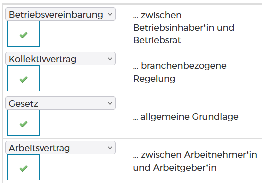

# Sozialpartnerschaft 

## Kammersystem 

### Kammern in Österreich

**Antwort/Frage**

### Interessen von Wirtschaftsteilnehmer:innen

**Frage**

Die österreichische Sozialpartnerschaft setzt sich aus den großen Interessenvertretungen der Arbeitnehmer:innen und Arbeitgeber:innen zusammen. Wie der Name bereits verrät, geht es um die Vertretung von Interessen.

Ziehen Sie folgende Stichwörter heran und überlegen Sie konkret, welche typischen Interessen Arbeitnehmer:innen und Arbeitgeber:innen in Bezug auf die Schlagwörter haben?

Arbeitszeit, Entlohnung, Urlaub, Umsatz, Wohlstand, Gesundheit

Versuchen Sie Unterschiede und gemeinsame Interessen herauszuarbeiten und halten Sie Ihre Überlegungen fest.

**Antwort**

#### Arbeitnehmer:innen:

- **Arbeitszeit:**
  - Kürzere oder flexiblere Arbeitszeiten
  - Bessere Arbeitsbedingungen und weniger Stress

- **Entlohnung:**
  - Höhere Löhne und Gehälter

- **Urlaub:**
  - Mehr Urlaubsstunden oder -tage
  - Flexible Urlaubsgestaltung

- **Gesundheit:**
  - Schutz vor Arbeitsunfällen und Gesundheitsgefahren

#### Arbeitgeber:innen:

- **Umsatz:**
  - Steigerung des Umsatzes und der Gewinne
  - Wettbewerbsfähigkeit auf dem Markt

- **Wohlstand:**
  - Steigerung des Unternehmenswerts

- **Arbeitszeit:**
  - Flexibilität bei der Arbeitszeitgestaltung
  - Reduzierung von Personalkosten

- **Gesundheit:**
  - Gesundheitsförderung in der Arbeit
  - Reduzierung von Krankenständen und Abwesenheitszeiten

### Die Kammern in Österreich

**Frage**

Wie Sie im Video erfahren haben, vertreten Kammern die Interessen von unterschiedlichen Berufsgruppen. Wählen Sie in der nachfolgenden Tabelle mithilfe des Drop-Down Menüs aus, um welche Kammer es sich bei dem beschriebenen Beispiel handelt.

**Antwort**

### Kammern als Körperschaft öffentlichen Rechts

**Frage**

Kammern sind in Österreich als Körperschaften öffentlichen Rechts organisiert. Außerdem zeichnen sie einige Merkmale aus, die sie einzigartig machen. Kreuzen Sie dazu nachfolgend die zutreffende(n) Aussage(n) an.

**Antwort**

### Mitgliedschaft bei Kammern

**Frage**

Wie Sie im Video erfahren haben, sind Kammern im Grunde Organisationen, die der Gesetzgeber, also der Staat, geschaffen hat. Wählen Sie mithilfe des Drop-Down Menüs aus, ob die folgenden Aussagen in Bezug auf die Mitgliedschaft bei Kammern zutreffen oder nicht.

**Antwort**

## Aufgaben der Kammern

### Aufgaben der Wirtschaftskammer

**Frage**

Recherchieren Sie zu Beginn dieses Moduls, welche Aufgaben die Wirtschaftskammer hat und fassen Sie die wichtigsten Punkte kurz zusammen.

Halten Sie sich dazu an folgende Leitfragen:

- Was sind die wichtigsten Aufgaben der Wirtschaftskammer?
- Wie profitieren die Mitglieder von ihrer Mitgliedschaft?

Verwenden Sie dazu folgendes Dokument:

[WKO_Aufgaben der Wirtschaftskammer.pdf](https://www.wko.at/oe/wko/aufgaben-wko)

**Antwort**

Die Wirtschaftskammer hat folgende Aufgaben:

- Vertretung der Interessen der Wirtschaft
- Förderung der Wirtschaftsentwicklung
- Aus- und Weiterbildung von Fachkräften
- Förderung der Innovation und des Technologietransfers
- Vertretung der Wirtschaft bei nationalen und internationalen Gremien

Die Mitglieder der Wirtschaftskammer profitieren von ihrer Mitgliedschaft durch:

- Zugang zu Informationen und Ressourcen für ihre Geschäftstätigkeit
- Teilnahme an Veranstaltungen und Seminaren für die Weiterbildung
- Unterstützung bei der Lösung von Problemen und der Förderung von Geschäftsbeziehungen
- Zugang zu speziellen Dienstleistungen und Angeboten für ihre Unternehmen

### Aufgaben der Arbeiterkammer

**Frage**

Recherchieren Sie nun auf der Homepage der Arbeiterkammer, welche Aufgaben diese erfüllt. Fassen Sie die wichtigsten Punkte kurz zusammen.

Halten Sie sich dabei an folgende Leitfragen:

- Was sind die wichtigsten Aufgaben der Arbeiterkammer?
- Wie profitieren die Mitglieder von ihrer Mitgliedschaft?

Verwenden Sie dazu folgende Webseite: [Aufgaben der AK](https://www.arbeiterkammer.at/ueberuns/leistungen/Aufgaben_der_AK.html)

**Antwort**

Aufgaben der Arbeiterkammer

Ich habe mich an die angegebene Webseite gehalten und die wichtigsten Punkte zusammengefasst. Hier sind die wichtigsten Aufgaben der Arbeiterkammer:

- **Vertreten von Interessen:** Die Arbeiterkammer verteidigt die Interessen der Arbeitnehmer und setzt sich für ihre Rechte ein.
- **Beratung und Unterstützung:** Die Arbeiterkammer bietet Beratung und Unterstützung bei arbeitsrechtlichen Fragen an.
- **Forschung und Entwicklung:** Die Arbeiterkammer betreibt Forschung und Entwicklung in den Bereichen Arbeitsrecht, Sozialpolitik und Wirtschaft.
- **Mitgliederdienstleistungen:** Die Arbeiterkammer bietet ihren Mitgliedern verschiedene Dienstleistungen an, wie z.B. Beratung bei arbeitsrechtlichen Fragen, Unterstützung bei der Suche nach Arbeit und Zugang zu weiteren Vorteilen.

#### Vorteile der Mitgliedschaft

Die Mitglieder der Arbeiterkammer profitieren von verschiedenen Vorteilen, wie:

- **Beratung und Unterstützung:** Mitglieder haben Zugang zu Beratung und Unterstützung bei arbeitsrechtlichen Fragen.
- **Zugang zu Vorteilen:** Mitglieder haben Zugang zu weiteren Vorteilen, wie z.B. Rabatten bei bestimmten Dienstleistungen.
- **Aktivitäten und Veranstaltungen:** Mitglieder können an Aktivitäten und Veranstaltungen teilnehmen, die von der Arbeiterkammer angeboten werden.

### Aufgabenbereiche der Arbeiterkammer

**Frage**

Wie Sie im Video erfahren haben, vertritt die Arbeiterkammer die Interessen von Arbeitnehmer:innen, also Arbeiter:innen und Angestellten. Wählen Sie in der nachfolgenden Tabelle mithilfe des Drop-Down Menüs aus, um welchen Aufgabenbereich es sich bei dem beschriebenen Beispiel handelt.

**Antwort**

### Aufgabenbereiche der Wirtschaftskammer

**Frage**

Die Wirtschaftskammer hat in erster Linie die Aufgabe, die Interessen von Unternehmer:innen, also Arbeitgeber:innen, zu vertreten. Wählen Sie in der nachfolgenden Tabelle mithilfe des Drop-Down Menüs aus, um welchen Aufgabenbereich es sich bei dem beschriebenen Beispiel handelt.

**Antwort**

### Aufgaben der Wirtschaftskammer im Bereich Außenhandel

**Frage**

Der Außenhandel stellt einen wichtigen Faktor der Wirtschaftsleistung Österreichs dar. Auch in diesem Bereich bietet die Wirtschaftskammer ihren Mitgliedern Unterstützung an.

Finden Sie mithilfe der Broschüre Antworten auf die folgenden Fragen:

- In wie vielen Ländern der Welt hat die Wirtschaftskammer Auslandsstandorte?
- Welche Serviceleistungen bietet die Wirtschaftskammer im Rahmen der „Außenwirtschaft Austria“?
- Warum ist die Arbeit der Wirtschaftskammer in Bezug auf den Außenhandel wichtig?

Verwenden Sie dazu die folgende Broschüre:

**Antwort**

- **In wie vielen Ländern der Welt hat die Wirtschaftskammer Auslandsstandorte?**
  → Die Wirtschaftskammer betreibt 76 AußenwirtschaftsCenter und 36 AußenwirtschaftsBüros in mehr als 70 Ländern weltweit.

- **Welche Serviceleistungen bietet die Wirtschaftskammer im Rahmen der „Außenwirtschaft Austria“?**
  → Die Wirtschaftskammer unterstützt Unternehmen mit:
  - **Wissen:** Beratung zur Internationalisierung, Veranstaltungen, Publikationen, Online-Portale, Social Media, ExportService-App.
  - **Plattformen:** Marktplätze, Messebeteiligungen, B2B-Veranstaltungen, Fresh View Kataloge, Webportal advantageaustria.org.
  - **Partner:** Kontakte zu Anwälten, Steuerberatern, Branchenexperten.
  - **Exportförderung:** Unterstützung durch die Initiative go-international, finanziert durch Kammerbeiträge und das Wirtschaftsministerium.

- **Warum ist die Arbeit der Wirtschaftskammer in Bezug auf den Außenhandel wichtig?**
  → Da fast 60 % der Wirtschaftsleistung Österreichs im Ausland verdient werden, ist die Unterstützung der Wirtschaftskammer essenziell. Sie hilft Unternehmen beim Export, vermittelt wichtige Kontakte und trägt zur Stärkung der internationalen Wettbewerbsfähigkeit bei.

### Preise beim Online-Shopping

**Frage**

Neben der Interessenvertretung sowie dem Servicebereich ist die Arbeiterkammer auch Ansprechpartner in Sachen Konsumentenschutz. Zusätzlich zur direkten Beratungshotline werden seitens der Arbeiterkammer auch Konsumententests und Preisvergleiche durchgeführt.

So wurden beispielsweise im März 2020 Preisschwankungen im Online-Handel untersucht. Lesen Sie dazu den folgenden Artikelausschnitt und kreuzen Sie anschließend die zutreffenden Aussagen an.

„Achterbahn“ bei Online-Preisen

Ein Schnäppchen aus dem Netz? Achtung, Online-Preise können je nach Endgerät und Tag mitunter extrem schwanken. Das zeigt ein AK Test von 30 Preisabfragen mit 14 verschiedenen Endgeräten an sechs unterschiedlichen Tagen in vier Bundesländern bei sechs Online-Anbietern.

Preise bei Online-Anbietern differieren je nach Endgerät und Tag

„Unser Test zeigt, dass Preisvergleiche für Online-Buchungen oder Online-Shopping zunehmend schwieriger werden. Es ist für Konsumenten nicht nachvollziehbar, wovon die unterschiedlichen Preise abhängen“, schlussfolgern die AK Konsumentenschützer:innen.

Konkret ergab der AK Test: Je nachdem welches Endgerät bei der Suche nach dem günstigsten Hotel für Oktober bei booking.com verwendet wurde, stellte man Preisunterschiede fest. So gab es bei booking.com bei fünf von sechs Hotels mindestens an einem Erhebungstag bis zu vier verschiedene Preise je nach Endgerät. Nur ein Beispiel: Die größte Preisdifferenz war bei einem Hotel in Sardinien – hier wurde bei sechs (Notebook/PC/McBook Air) von 14 Endgeräten sogar ein um 26,3 Prozent (278 Euro) höherer Preis angezeigt als bei zwei Smartphones.

Bei den Flügen stellte die AK bei opodo.com und swoodoo.at je nach Endgerät mitunter große Preisunterschiede fest. So gab es etwa bei opodo.com bei allen vier erhobenen Flügen an jedem Erhebungstag bis zu zehn verschiedene Preise und bis zu rund 400 Euro (44,9 Prozent) Preisdifferenzen je nach Endgerät.

Bei allen Online-Anbietern gab es im Untersuchungszeitraum mindestens eine Preisänderung im Zeitverlauf. Die Preise schwankten von 0,5 bis zu über 300 Prozent. Die Regionalität (d. h. wo sich der Besitzer/die Besitzerin des Endgerätes zum Zeitpunkt der Abfrage aufhielt) hatte im Untersuchungszeitraum keinen Einfluss auf die Preise.

### Arbeiterkammer und Konsumentenschutz

**Frage**

Die Arbeiterkammer setzt sich aktiv für den Schutz der Konsument:innen ein. Auch auf ihrer Homepage stellt sie in diesem Bereich einige hilfreiche Informationen zur Verfügung.

Recherchieren Sie auf der Seite der Arbeiterkammer 5 Tipps zum Konsument:innenschutz und halten Sie diese in Stichworten fest.

**Antwort**

#### Tipps der Arbeiterkammer zum Konsument:innenschutz

- **Vorsicht bei Bewertungsplattformen:** Nicht alle Online-Bewertungen sind authentisch; seien Sie skeptisch gegenüber extrem positiven oder negativen Bewertungen.
- **Sichere Zahlungsmethoden im Internet nutzen:** Verwenden Sie beim Online-Shopping sichere Zahlungsmethoden wie Kreditkarten oder seriöse Zahlungsdienstleister.
- **Tricks von Online-Händlern erkennen:** Achten Sie auf mögliche Täuschungen wie versteckte Kosten oder irreführende Produktbeschreibungen.
- **Tipps zum Anbieterwechsel bei Festnetz & Internet:** Informieren Sie sich gründlich über Vertragsbedingungen und mögliche Kostenfallen beim Wechsel des Anbieters.
- **Vorsicht vor gefälschten E-Mails von Banken:** Öffnen Sie keine verdächtigen E-Mails und geben Sie keine persönlichen Daten preis, um Phishing-Angriffe zu vermeiden.

## Das Zusammenspiel der Kammern in der Sozialpartnerschaft

### Interessen innerhalb eines Unternehmens

**Frage**

Nicht nur auf überbetrieblicher Ebene gibt es unterschiedliche Interessen, sondern auch innerhalb eines Betriebes bzw. eines Unternehmens kann es zu unterschiedlichen Interessen auf Seiten der Arbeitnehmer:innen und Arbeitgeber:innen kommen. Damit nicht jede:r Arbeitnehmer:in seine:ihre Interessen gegenüber dem:der Betriebsinhaber:in einzeln vertreten muss, gibt es auch in Betrieben eine Vereinigung, die die Interessen der Belegschaft fördert und vertritt. Diese Interessenvertretung wird auch Betriebsrat genannt. Informieren Sie sich im Internet zur Beantwortung der folgenden Fragen:

a) Wie entsteht ein Betriebsrat?

b) Welche Aufgaben hat der Betriebsrat?

c) Was ist eine Betriebsversammlung und wie setzt sich diese zusammen?

d) Welche Aufgaben hat die Betriebsversammlung?

**Antwort**

a) **Wie entsteht ein Betriebsrat?**

Ein Betriebsrat kann in Betrieben mit mindestens fünf dauerhaft beschäftigten Arbeitnehmer:innen gegründet werden. Der Gründungsprozess beginnt mit der Einberufung einer Betriebsversammlung, in der ein Wahlvorstand gewählt wird. Dieser Wahlvorstand ist für die Organisation und Durchführung der Betriebsratswahl verantwortlich. 

b) **Welche Aufgaben hat der Betriebsrat?**

Der Betriebsrat hat die Aufgabe, die Interessen der Arbeitnehmer:innen wahrzunehmen. Zur Erfüllung dieser Aufgaben stehen ihm Überwachungsrechte zu. 

c) **Was ist eine Betriebsversammlung und wie setzt sich diese zusammen?**

Eine Betriebsversammlung ist ein Treffen aller Arbeitnehmer:innen eines Betriebs. Sie dient als Plattform für den Austausch zwischen Belegschaft und Betriebsrat. In der Regel wird sie vom Betriebsrat einberufen und geleitet. 

d) **Welche Aufgaben hat die Betriebsversammlung?**

Die Aufgaben der Betriebsversammlung umfassen:

- Behandlung von Berichten des Betriebsrats und der Rechnungsprüfer:innen.
- Wahl des Wahlvorstandes für die Betriebsratswahl.
- Beschlussfassung über die Einhebung und Höhe einer Betriebsratsumlage sowie über die Art und Weise der Auflösung des Betriebsratsfonds.
- Beschlussfassung über die Enthebung des Betriebsrats.
- Beschlussfassung über die Enthebung des Wahlvorstandes für die Betriebsratswahl.

### Sozialpartnerschaft in Österreich

**Frage**

Kreuzen Sie die zutreffende(n) Aussage(n) zur österreichischen Wirtschafts- und Sozialpartnerschaft an.

Die österreichische Wirtschafts- und Sozialpartnerschaft ...

**Antwort**

### Die Zusammenarbeit der Sozialpartner

**Frage/Antwort**

### Aufgaben der Sozialpartnerschaft

**Frage/Antwort**

### Interessenbereiche der Arbeitnehmer:innen

**Frage**

Die Interessen der Belegschaft, welche der Betriebsrat gegenüber den Arbeitgeber:innen vertritt, sind vielfältig, können aber grob in vier Bereiche zusammengefasst werden. Lesen Sie die folgenden Beispiele und ordnen Sie diese mithilfe des Drop-Down Menüs dem jeweiligen Interessenbereich zu.  

**Antwort**

## Der Kollektivvertrag

### Was regeln Kollektivverträge?

**Frage**

Im Herbst hört man häufig: „Die Metaller verhandeln wieder ...“. Konkret geht es dabei um die Kollektivvertragsverhandlungen der Metallindustrie. Bei den Verhandlungen kommen die Interessenvertretungen der Arbeitgeber:innen sowie der Arbeitnehmer:innen zusammen, verhandeln über den Kollektivvertrag und schließen diesen ab. Doch welche Inhalte werden im Kollektivvertrag überhaupt geregelt und wozu das Ganze?

Lesen Sie zu Beginn die Schlagzeilen zu Kollektivverträgen und überlegen Sie, welche Inhalte hier verhandelt wurden. Notieren Sie Ihre Überlegungen stichwortartig.

**Antwort**

Überlegungen zu den Inhalten der Kollektivverträge (Stichpunkte)

Aus den Schlagzeilen lassen sich folgende zentrale Inhalte von Kollektivverträgen ableiten:

- **Lohnerhöhungen:** z. B. 2,6–2,8 % mehr Gehalt für die Metaller, Lohnplus von 2,7 % bei der Caritas
- **Arbeitszeitregelungen:** z. B. Senkung der Normalarbeitszeit auf 37 Stunden bei der Caritas
- **Zusätzliche Sozialleistungen:** z. B. ein zusätzlicher freier Tag für langjährige Mitarbeiter:innen in privaten Bildungseinrichtungen
- **Geltungsdauer des Kollektivvertrags:** z. B. mehrjährige Vereinbarungen, wie bei der Caritas über drei Jahre

#### Allgemeine Regelungen in Kollektivverträgen

Ein Kollektivvertrag legt die Mindeststandards für Arbeitsbedingungen in einer Branche fest. Er regelt unter anderem:

- Lohn- und Gehaltstabellen (Mindestlöhne und -gehälter für verschiedene Berufsgruppen)
- Arbeitszeitregelungen (Normalarbeitszeit, Überstundenregelungen)
- Urlaubs- und Feiertagsansprüche
- Zulagen und Zuschläge (z. B. Nacht-, Wochenend- oder Gefahrenzulagen)
- Kündigungsfristen und Abfertigungsregelungen
- Weiterbildungsmöglichkeiten und berufliche Entwicklung

### Der Nutzen von Kollektivverträgen

**Frage**

Überlegen Sie sich in einem zweiten Schritt, warum es solche Kollektivverträge überhaupt gibt und für wen diese gelten könnten. Notieren Sie Ihre Notizen stichwortartig. Folgende Fragen können Sie hier mitunter heranziehen:

- Welche Vorteile könnten Kollektivverträge den Arbeitnehmer:innen bringen?
- Könnten sich durch die verhandelten Inhalte der Kollektivverträge Nachteile für Arbeitgeber:innen ergeben?
- Ist jeder Kollektivvertrag für jede Person gültig?

**Antwort**

Nutzen von Kollektivverträgen (Stichpunkte)

#### Vorteile für Arbeitnehmer:innen

- Sicherung fairer Löhne
- Geregelte Arbeitszeiten und Kündigungsfristen
- Zusätzliche Leistungen (z. B. Urlaubs- & Weihnachtsgeld)
- Stärkung der Verhandlungsmacht

#### Mögliche Nachteile für Arbeitgeber:innen

- Höhere Personalkosten
- Weniger Flexibilität bei Arbeitszeiten & Kündigungen
- Verpflichtung zur Einhaltung strengerer Standards

#### Geltungsbereich

- Branchen- oder berufsspezifisch
- Gilt für Arbeitnehmer:innen, wenn Arbeitgeber Mitglied der Wirtschaftskammer ist
- Einzelverträge dürfen nicht schlechter sein als der Kollektivvertrag

### Stufenbau der Rechtsordnung

**Frage**

Das Arbeitsrecht ist in unterschiedlichen Rechtsquellen verankert. Diese sind im Allgemeinen im Stufenbau der Rechtsordnung gegliedert. Geben Sie mithilfe des Drop-Down Menüs die richtigen Rechtsquellen an.

**Antwort**

### Arbeitsvertrag

**Frage**

**Antwort**

Die Regelungen im Arbeitsvertrag von Camille Horvat müssen mit dem Kollektivvertrag für Fahrradboten und dem österreichischen Arbeitszeitgesetz verglichen werden. Laut Kollektivvertrag beträgt die regelmäßige wöchentliche Normalarbeitszeit 40 Stunden. Eine Ausdehnung auf bis zu 48 Stunden pro Woche ist möglich, solange der Durchschnitt von 40 Stunden innerhalb eines 52-Wochen-Zeitraums nicht überschritten wird. Die tägliche Normalarbeitszeit darf maximal 10 Stunden betragen. Diese Bestimmungen stimmen mit dem österreichischen Arbeitszeitgesetz überein, das eine Normalarbeitszeit von 40 Stunden pro Woche vorsieht und unter bestimmten Bedingungen eine Durchrechnung auf bis zu 48 Stunden erlaubt. Eine tägliche Arbeitszeit über 10 Stunden wäre jedoch nicht zulässig.

Zusätzliche Regelungen zur Arbeitszeit könnten im Arbeitsruhegesetz, das Ruhepausen und Wochenendruhezeiten regelt, oder in betrieblichen Vereinbarungen enthalten sein. Sollte Camille rechtswidrige Klauseln in ihrem Vertrag finden, könnte sie sich an die Arbeiterkammer wenden, die sie in arbeitsrechtlichen Fragen berät. Auch die Gewerkschaft vida, die für Fahrradboten zuständig ist, oder das Arbeitsinspektorat, das die Einhaltung des Arbeitszeitgesetzes überprüft, wären mögliche Anlaufstellen.

### Inhalte eines Kollektivvertrages

**Frage** 

Kreuzen Sie an, welche Inhalte in Kollektivverträgen geregelt werden können.

**Antwort**

### Kollektivvertragsverhandlungen

**Frage** 

Die Interessenverbände verhandeln Kollektivverträge und schließen diese bestenfalls auch ab. Kreuzen Sie nachfolgend die zutreffende(n) Aussage(n) zu Kollektivvertragsverhandlungen an.

**Antwort**

### Das österreichische Kollektivvertragssystem

**Frage**

Geben Sie an, ob die folgenden Aussagen zum österreichischen Kollektivvertragssystem zutreffen oder nicht.

