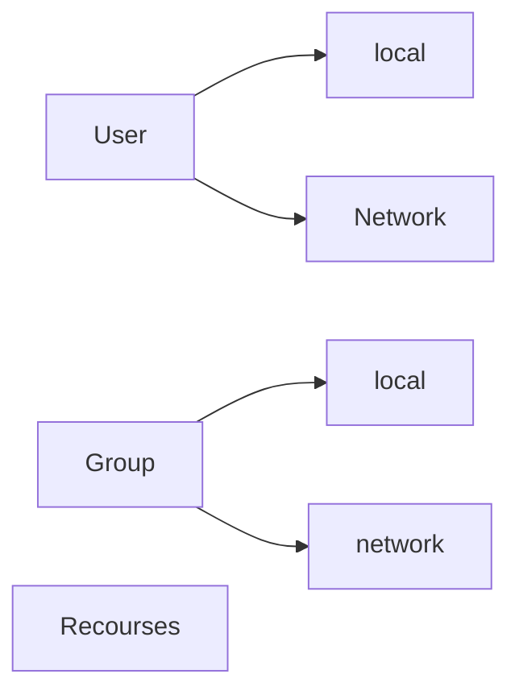

# Authentication and Authorization

## Authentication methods

- Password (+User)
- Face scan
- Finger scan
- PIN
- Smartkart
- 2FA

## Schwächen von Passwörtern

- zu kurz
- zu einfach
- nicht sicher aufbewahrt
- geleakt(Provider Gehackt)

## Schützen von Passwörtern

- jedes Konto eigenes Passwort
- Passwort Tresor (Keepass,Bitwarden,OnePassword)
- Pogrammierer
    - nicht im klartext speichern! (crypto, hash)
