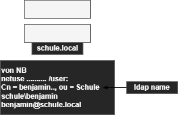

# ldap

ähnlich wie aktive directory

- <u>Baum</u> von Objekten unterschiedlicher Objectclassen
- Jede Objektklasse besthet aus Atrtributen
- Objektklassen unterstützen Vererbung
- Name des Objektes besteht aus einem Attribut des Objektes und dem Namesn des übergeordneten Objektes

   
