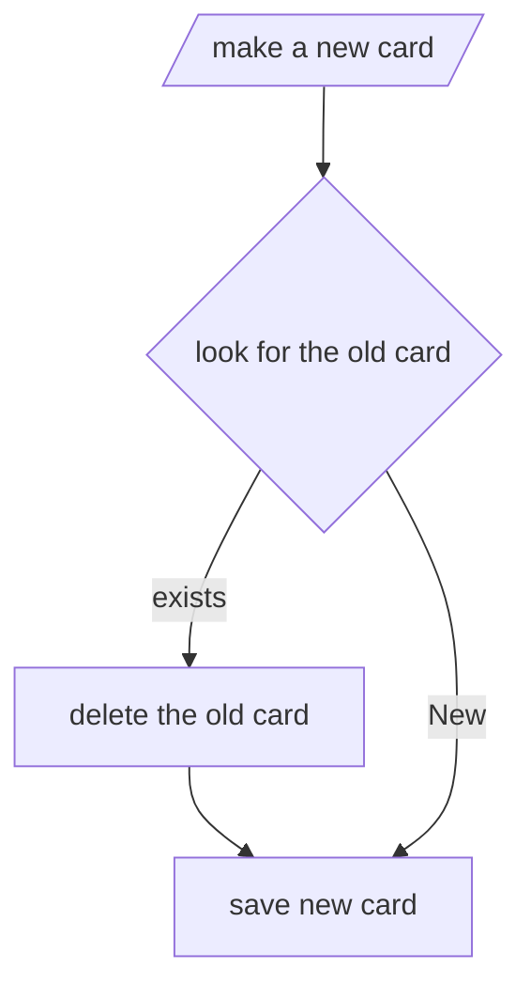
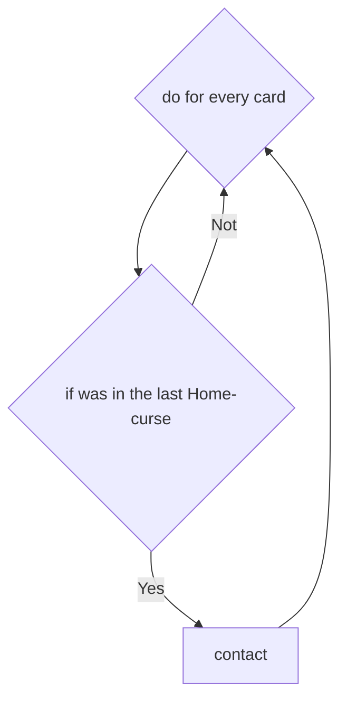
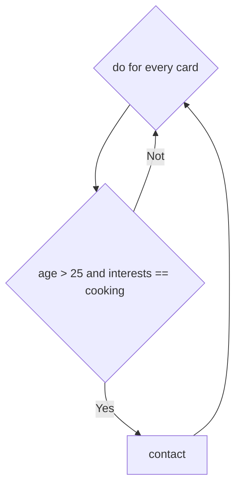

# Menine Kleine Schule

## 1

```mermaid
flowchart TD
in[/make a new card/]
look{look for the old card}
del[delete the old card]
save[save new card]

in --> look
look --exists-->del
del --> save
look --New-->save
```

## 2

```mermaid
flowchart TD
loop{do for every card}
if{age>60 and area == Linz and area Linz}
send[contact]
loop --> if
if --Yes--> send
if --Not--> loop
send --> loop
```

## 3

```mermaid
flowchart TD
loop{do for every card}
if{is former participant and area == Urfahr}
send[contact]
loop --> if
if --Yes--> send
if --Not--> loop
send --> loop
```

## 4

```mermaid
flowchart TD
loop{do for every card}
if{if was in the last Home-curse}
send[contact]
loop --> if
if --Yes--> send
if --Not--> loop
send --> loop
```

## 5

```mermaid
flowchart TD
loop{do for every card}
if{age > 25 and interests == cooking}
send[contact]
loop --> if
if --Yes--> send
if --Not--> loop
send --> loop
```
