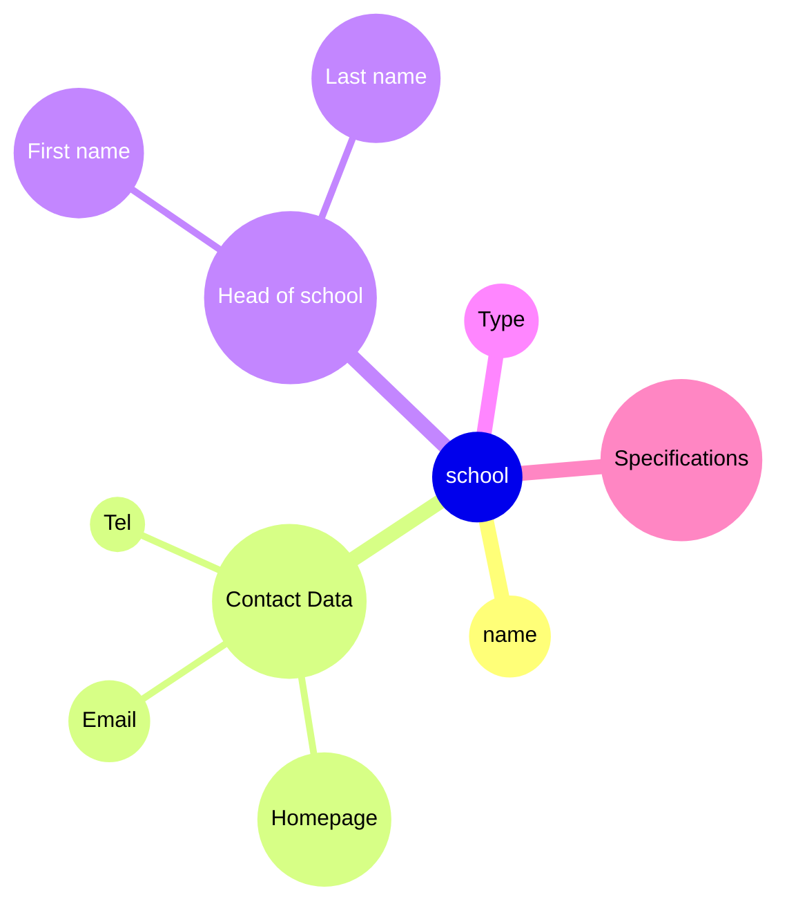
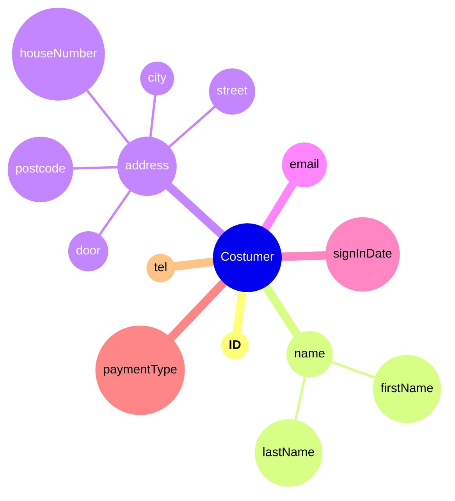

# Entitytypen

## 1

### Data Dictionary

**Entitytyp**: School \
**Attribute**: NAME,  headofSchool, specifications, type, contectData

- **specifications** = [ VS | NMS | AHS | BMHS | etc ]
- **contectData** =  Hompage + Email + Tel
- **headofSchool** = FirstName + LastName
- **type** = [ TS | FS | AS ]
- **Primarikey**: NAME

### graphic

## 2

### Data Dictionary

**Entitytyp**: Costumer \
**Attribute**: ID, name, address, email, signInDate, 1{paymentType}, 0{tel}1

- **name** = firstName + lastName + title
- **address** = city + postcode + street + houseNumber + door
- **Primarykey** = ID

### graphic

