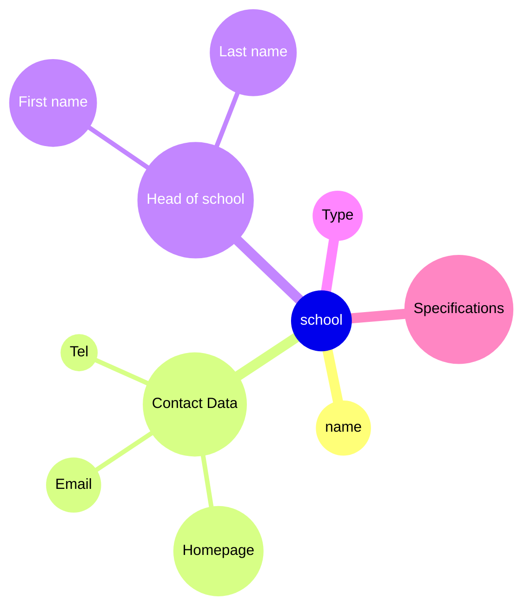

# Entitytypen

## 1

## Data Dictionary

**Entitytyp**: School \
**Attribute**: NAME,  headofSchool, specifications, type, contectData

- **specifications** = [ VS | NMS | AHS | BMHS | etc ]
- **contectData** =  Hompage + Email + Tel
- **headofSchool** = FirstName + LastName
- **type** = [ TS | FS | AS ]
- **Primarikey**: NAME

## graphic



## 2

## Data Dictionary

**Entitytyp**: Kunde \
**Attribute**: ID,  headofSchool, specifications, type, contectData

- **specifications** = [ VS | NMS | AHS | BMHS | etc ]
- **contectData** =  Hompage + Email + Tel
- **headofSchool** = FirstName + LastName
- **type** = [ TS | FS | AS ]
- **Primarikey**: NAME

## graphic

```mermaid
mindmap

```