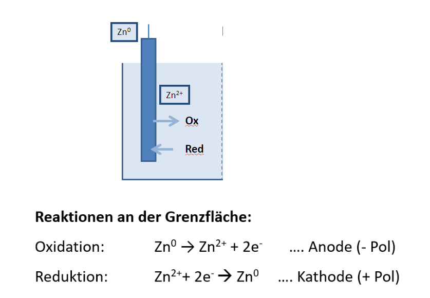
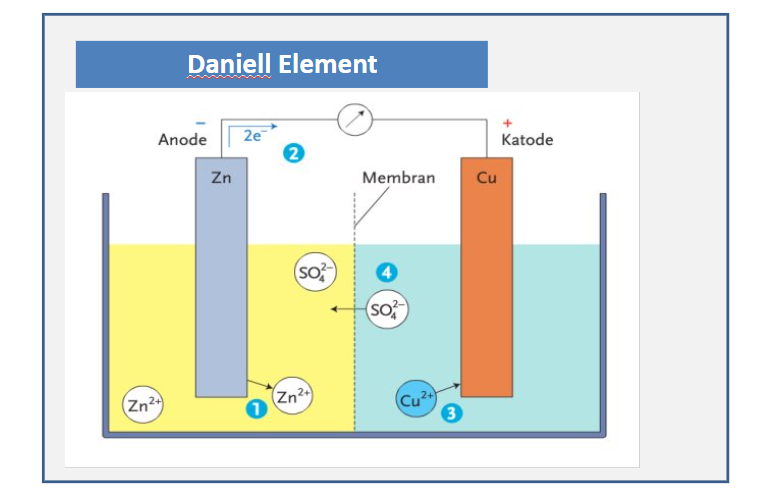

# Redox Reaktion

## Oxidations Zahlen Regeln

- Elemente haben Oxzahl **0**
- Die Summe der Oxzahlen ist immer Null
- Sauerstoff in verbindung mit anderen Elementen immer 
- rest im teams

$$
Mg^0+Cl^0 \rArr Mg^{2+}Cl^{1-} _2
$$

1.

$$
2Cu^{2+}O^{2-} + C^0 \rArr 2Cu^0 + C^{4+}O_2^{2-}
$$
- Cu: Reduziert
- C: oxidiert

## Beispiele

- Rost
- Verbrennen
- Photosynthese
- Verdauung

## baterie 

