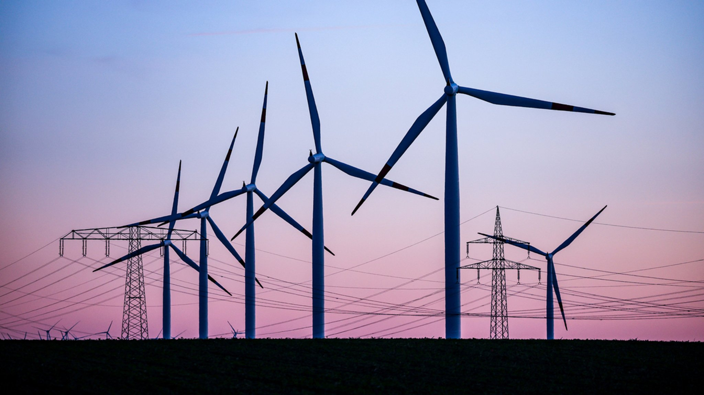
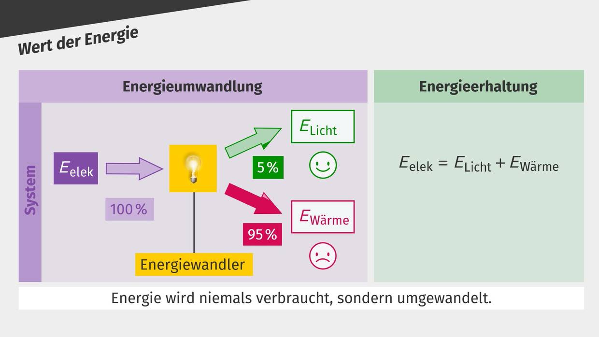
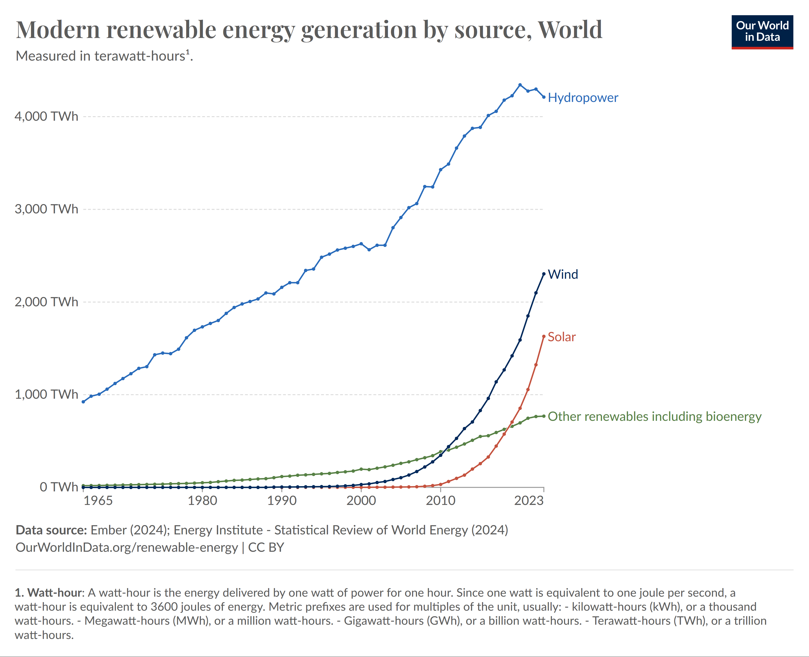
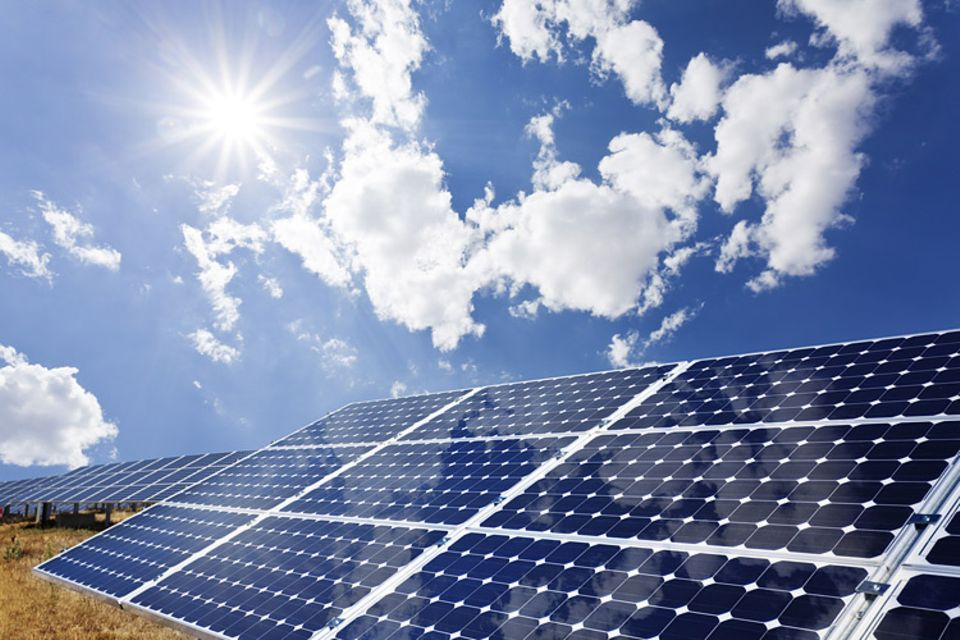
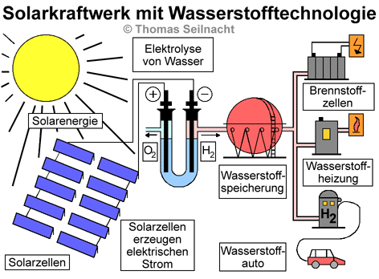
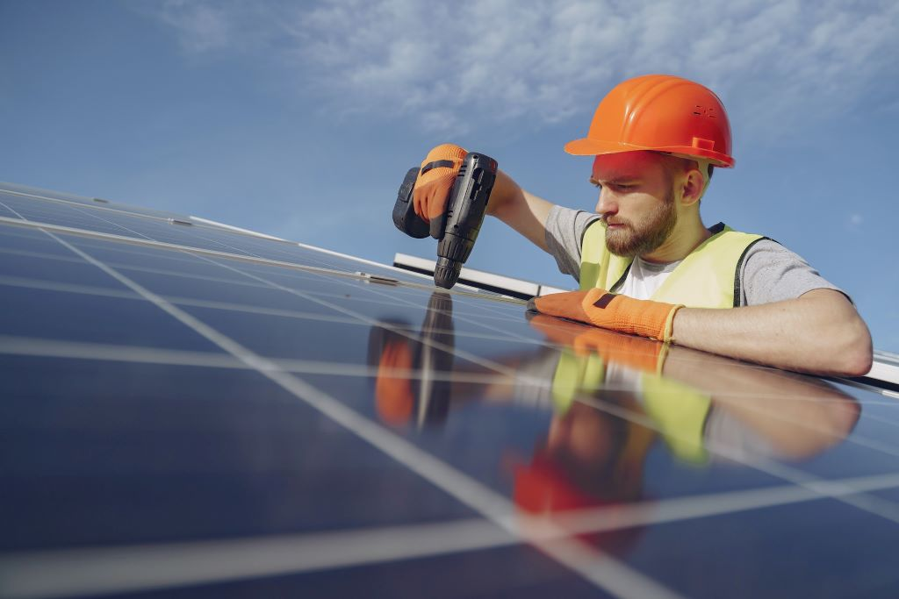
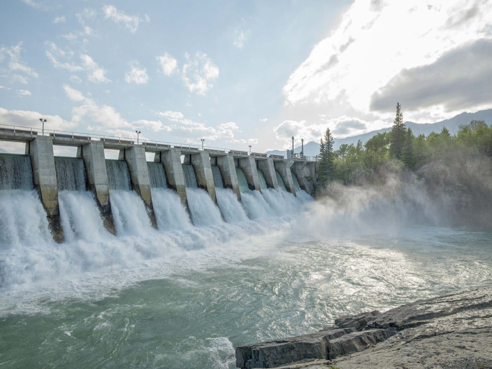
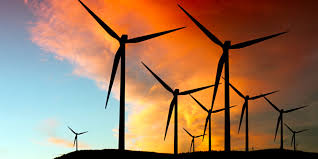
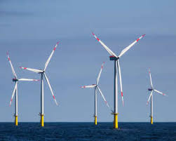

## Was sind alternative Energieträger?

Alternative Energieträger sind erneuerbare Energiequellen, die:
- Umweltfreundlich sind
- Sich natürlich erneuern
- Nicht endlich sind wie fossile Brennstoffe
- CO2-neutral oder -reduziert sind

https://img.br.de/3120a23a-f1d9-4d76-8ed4-f249bd53aceb.jpeg?q=85&rect=2%2C114%2C1078%2C606&w=2048

---

## Chemische Grundlagen der Energieumwandlung

### Energieformen und Umwandlung
- Chemische Energie → Elektrische Energie
- Potentielle Energie → Kinetische Energie
- Strahlungsenergie → Thermische Energie

### Wirkungsgrad η
η = (Nutzenergie / Zugeführte Energie) × 100%

https://images.cdn.sofatutor.net/content_images/images/15190/normal/Wert_der_Energie.jpg?1662984614

---

## Geschichte der alternativen Energien

### Historische Entwicklung
- **Wasserkraft**: Bereits in der Antike (Wassermühlen)
- **Windkraft**: Erste Windmühlen im 7. Jahrhundert in Persien
- **Sonnenenergie**: Erstes Solarhaus 1939 durch MIT
- **Photovoltaik**: 1954 erste moderne Solarzelle (Bell Labs)
  
--- 

### Meilensteine
- 1973: Ölkrise → verstärkte Forschung
- 1991: Erstes Offshore-Windrad (Dänemark)
- 2000: Deutsches EEG als Vorbild weltweit
- 2015: Pariser Klimaabkommen
- 

https://upload.wikimedia.org/wikipedia/commons/8/81/Modern_renewable_energy_generation_by_source%2C_World.png

---

## Sonnenenergie

### Funktionsweise
- Photovoltaik: Direkte Umwandlung von Sonnenlicht in elektrische Energie
- Solarthermie: Umwandlung von Sonnenlicht in Wärmeenergie

https://image.geo.de/30087424/t/F_/v3/w960/r0/-/solarenergie-gross-jpg--42200-.jpg

---

## Sonnenenergie: Chemische Prozesse

### Photovoltaik
- Halbleiter-Technologie (meist Silizium)
- p-n-Übergang erzeugt elektrisches Feld
- Photoelektrischer Effekt: Photonen lösen Elektronen
- Dotierung mit Phosphor (n) und Bor (p)

### Solarthermie
- Absorption durch dunkle Oberflächen
- Wärmeübertragung durch Konvektion
- Wärmeträgermedien: Glykol-Wasser-Gemische

https://www.seilnacht.com/Lexikon/solkraft.gif

---

### Sonnenenergie: Vor- und Nachteile

|  Vorteile | Nachteile |
|-------------|-------------|
| Unendlich verfügbar | Wetterabhängig |
| Keine direkten Emissionen | Speicherung notwendig |
| Geringe Wartungskosten | Hohe Anfangsinvestitionen |

https://www.klimaworld.com/media/magefan_blog/Solaranlage-selbst-installieren.jpg

---

## Wasserkraft

### Arten
- Laufwasserkraftwerke
- Speicherkraftwerke
- Gezeitenkraftwerke

---

### Wasserkraft: Vor- und Nachteile

|  Vorteile | Nachteile |
|-------------|-------------|
| Sehr zuverlässig | Eingriff in Ökosysteme |
| Hoher Wirkungsgrad | Hohe Baukosten |
| Langlebige Technologie | Standortabhängig |

https://schubert.tech/web2021/wp-content/uploads/2022/01/schubert-wasserkraft-is1322319349-scaled.jpg

---

## Windkraft

### Funktionsweise
- Windräder wandeln Bewegungsenergie in Strom um
- Verschiedene Größen und Bauarten möglich
- On- und Offshore-Anlagen

https://www.ingenieur.de/wp-content/uploads/2022/11/windturbine-e1667984896444-980x490.jpg

---

### Windkraft: Vor- und Nachteile

|  Vorteile  | Nachteile  |
|-------------|-------------|
| Kostengünstig im Betrieb | Windabhängig |
| Keine Emissionen | Auswirkungen auf Landschaftsbild |
| Flächeneffizient | Geräuschentwicklung |

https://lh6.googleusercontent.com/proxy/do-xEkOKyC3fAse4kOaJiCN-02FlnZZSDqUhcVeWxxr45IB1NZFBdEgb_W5ZpT2CeN-tUSCYgRZNYf6qRZ7-ph1CZUVg3LQmCuzJ-QId6cB1jMHQjZSB5JlbMlCSXsrPQBaFM0FuBJgC5qjEB3qVv428hv7r

---

## Wasserstoff als Energiespeicher

### Herstellung
- Elektrolyse: 2 H2O → 2 H2 + O2
- Dampfreformierung: CH4 + H2O → CO + 3 H2
- Biomasse-Vergasung

### Brennstoffzelle
- Reaktion: 2 H2 + O2 → 2 H2O
- Wirkungsgrad bis 60%
- Keine schädlichen Emissionen