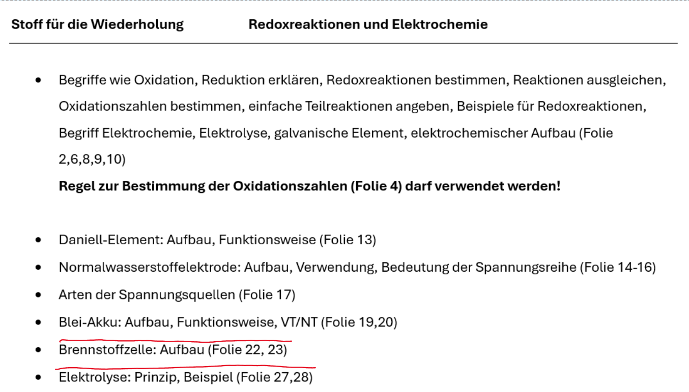

# Stoff für die Wiederholung

## Bsps

### 1

$$
KNO_3 + S \rightarrow K_2SO_4 + NO\\
\text{ausgleichen: }
2KNO_3 + S \rightarrow K_2SO_4 + 2NO\\
\text{Oxidationszahlen: }\\
2K^1N^5O^{-2}_3 + S^0 \rightarrow K^1_2S^6O^{-2}_4 + 2N^2O^{-2}\\
$$

### 2

$$
8H^1J^{-1} + H^1_2SO^{-2}_4 \rightarrow H^1_2S1{-2} + 4J^0_2 + 4H^1_2O^{-2}
$$
$j ( 1- \rightarrow 0)$oxidiert

$s(6+ \rightarrow2-)$reduziert
