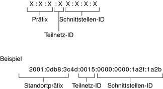

# IPv6 Adressen

## Einleitung

- Zeichnet sich durch die enorme Anzahl an Adressen aus
- Der Header hat <u> fix </u> 40 Byte
  - im Header sind
    - Routing Optionen 
    - Daten zur fragmentierung
    - Audentifikation
    - Verschlüsselung
    - usw
  
## Adressraum IPv6

- IPv4 hat $4.3\times10^9$ (32bit)
- IPv6 hat $3.4\times10^{38}$ (128bit)
- Jeder host hat min 2 IPv4 adressen bei IPv6 sind es ca 5 oder 6
- Es gib kein NAT oder PAT mehr
- Zur auffindung eines Nachberhosts NDP

## Vorteile

- Mehr Adressen pro Schnittstelle
- Routing ist viel schneller weil header standartiesiert ist (40bit)
- eine P2P-Verschlüsselung
  
## Aufbau

### 

- #### 128 bit lang eingeteilt in 8 Felder zu jeweils 16 bit getrennt mit ":"

- #### Unterteilung in
  
  - ersten 48 bit sind Routing-Präfix
    - Präfix nocheinmal unterteilt in:
      - ersten 3 bit Format Präfix
      - dann 13 bit Top Level Aggregation (für Weltweit agierende Provider)
      - dann 8 bit TLA und SLA
  - dann 16 bit Subnet-ID
  - dann 64 bit Inteerface-ID

- #### in Hexerdezemal
  
  - #### umrechnen
  
    - Hex: d_8_5_f
    - Dez: 13_8_5_15
    - Bin: 1101_1000_0101_1111

- #### Nuller-Blöcke  werden mit "::" abgekürzt <u>geht nur einmal pro Adresse</u> (sonst kann man nicht wissen wie viele blöcke wo fehlen)

- #### Führende Nullen werden weggelassen
  
- #### Dastellung in einer URL:

  - http://[IPv6-Adresse]:Port

- #### Weltweiter Providor bekommt einen präfix von 32 bit und kann dann adressen mit einem Präfix von 64 bit weitergeben

  - das hält die Routing Tabellen klein

## Adress Typen

- Unicast. Global Unicast. Unique Local. Link-Local. Site-Local. Unspecified. Loopback.
- Multicast.
- Anycast.
- [Adress Types .pdf](https://www.ripe.net/media/documents/ipv6_reference_card.pdf)
  - Unterscheiden sich an den ersten 16 bit
## Genauere typen
- Link-Local : fe80::/10 und einer 64 bit Interface-ID 
  - Jeder adresse muss sowas haben
  - Adressen werden nicht geraouted
  - kann man nur im selben internet finden 
- Global Unicast 2001::
  - bestet aus einer Routing-Präfix einer Subnetz-ID und einer Interface-ID
- Unique Local Unicast Adressen fc00::/7