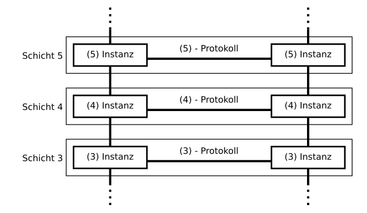

# Routing 2

- Routing Defenition 
  - outing is the process of path selection in any network
- Switching vs Routing
  - Routing refers to finding a path between two or more networks and switching refers to moving data from one device to another within a network
- Schtenmodell
  - 
  - Routing Network Layer (Vermittlungsschicht) 3
  - Switching Data Link Layer (Sicherungsschicht) 2
- 