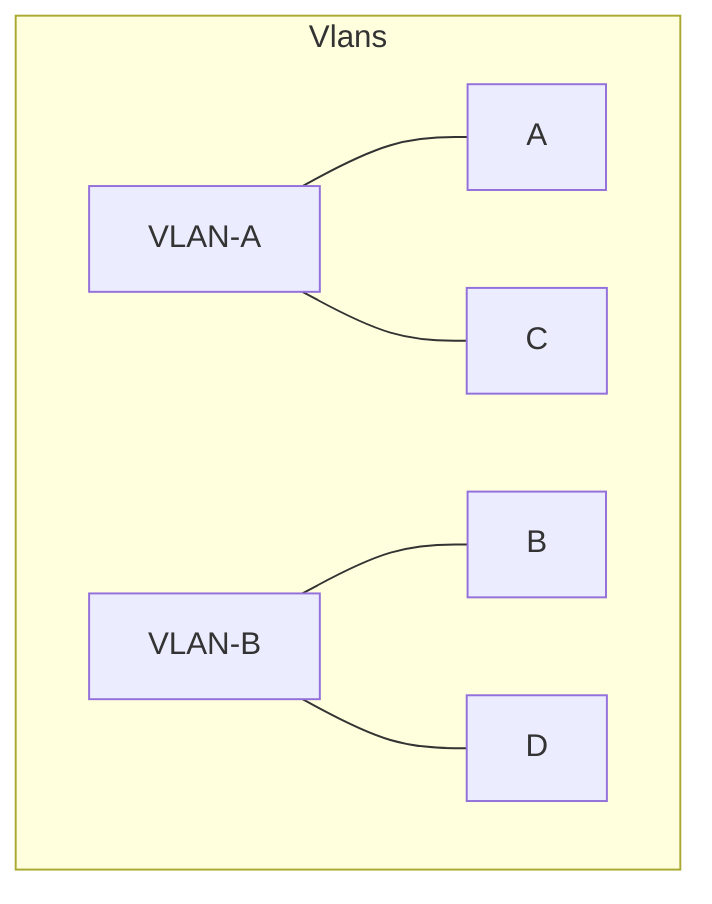

# Switching 2

## VLAN

- **geswitchede weiterleitung ist immer schneller als eine geroutete weiterleitung**
  - weil switch am layer 2 agiert und router am layer 3

- **Paket das von einem Switch weiter geleitet wird**
  - **Max 1522Byte lang**
  - präamble
  - ...
  - Dest
  - Sour
  - VLan
  - Length
  - Data
  - ...
  - FCS
  
### Mac bassiertes VLAN
  
- Sitches ekommen eine Tabelle mit MAC-Adressen und den zugewiesenen VLANs.

### Port bassiertes VLAN

- Die andere Methode ist sicherer

### Trunks

- Eine Verbindung zwischen Switches die die getaggten Parkete Tansportiert (der Tag bleibt immer im Taket). Solche Verbindungen nennt man Trunks
- Erst wenn ein Parket das Ziel erreicht hat wird der Tag entfernt

### Kommunikation zwischen VLANs

- Grundsätzlich können Hosts innerhalb des VLANs nicht mit Hosts auserhalb komunizieren.
- Also muss man ein Routing zwischen diesen netzen machen
- Die Vlans sind über Router auf Layer 3 miteinander verbunden
- der Router bekommt nichts vom Tagging mit

## Zusammenfassung

- Es gibt definierte Standarts zu VLANs.
  - 802.1q die häufigste Implementierrung
  - damit ist es nur möglich verschidenen Subnetze an verschiedenen Stellen in einem Gebäude zu konfigurieren
- Vlans werden in der Regel nur in einen Layer 2 Umgebung Transportiert